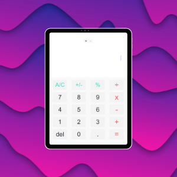
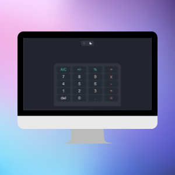

# Ultimate Calculator 

## Description

The project consists of a basic calculator that performs the primary mathematical operations: addition, subtraction, multiplication, and division. Likewise, Ultimate Calculator works with percentages, real numbers and negative values. You can use the calculator in dark or light mode, it is designed responsively to work correctly on mobile devices, tablets and laptops. Finally, the project is a web application created with the progressive framework Vue.js.

**Direct access: **https://hugoriveros18.github.io/ultimate-calculator/

## Preview
As mentioned before, the web application is responsively designed to function correctly on mobiles, tablets, laptops or desktop computers.

***Mobile***

***Tablet***

***Laptop***

## Project Status

Ultimate Calculator is a personal project created to practice programming skills with a simple web application. Any doubt, question or suggestion send an email to hugoriverosfajardo@gmail.com and it will be answered in the shortest possible time.
